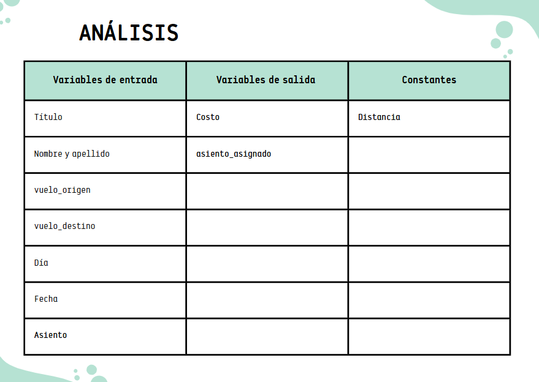

## Diagrama de bloques 

## Análisis 

## Pseudocódigo 

Inicio 
 print("Sr ó Sra")
 Leer título 
 Leer nombre y apellido 

print("Bienvenido a FastFast Airlines)

print("Escoja lugar de origen: Medellín, Bogotá, Cartagena")
Leer lugar de origen 

print("Escoja lugar de destino: Medellín, Bogotá, Cartagena")
Leer lugar de destino 

print("Seleccione día de la semana y número de día del vuelo)

